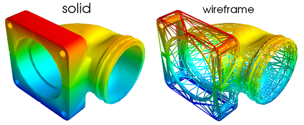
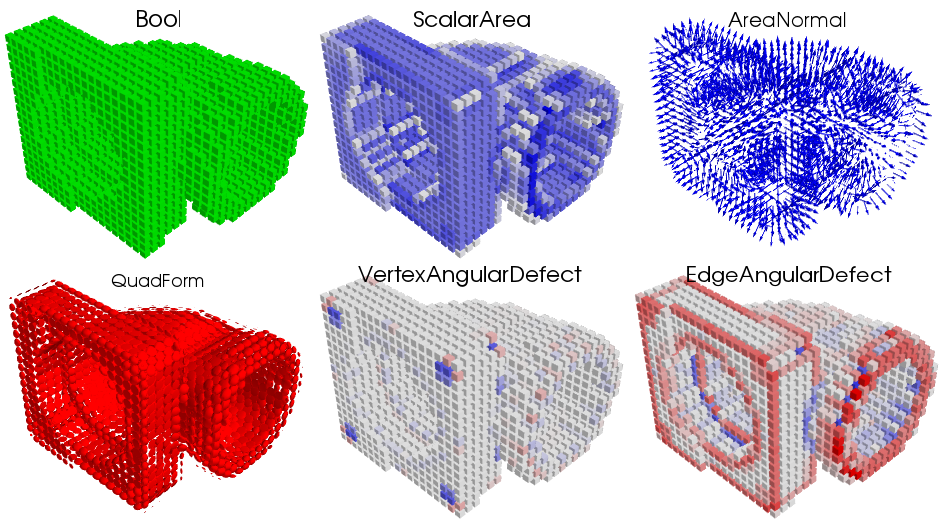
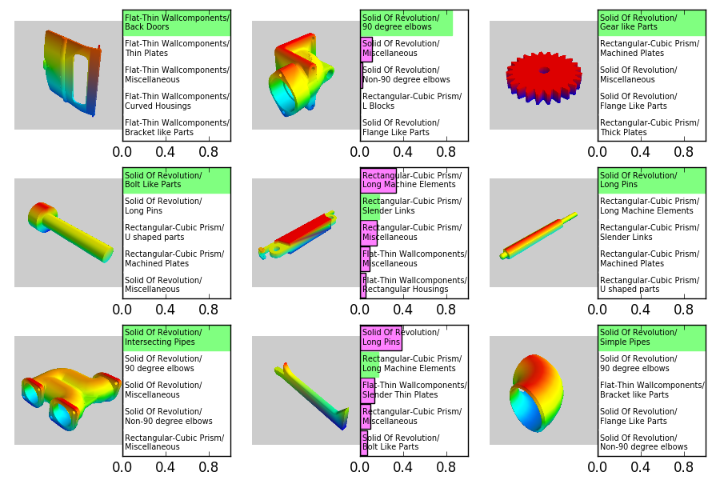

# voxelfeatures

## Local geometric features for voxel-based representation of surfaces in 3D

### [Dmitry Yarotsky](http://yarotsky.info), [Skoltech](http://skoltech.ru)/[IITP](http://iitp.ru), 2016, GPLv3 

* A collection of routines to generate voxel features describing local area, curvature and orientation of the surface
* Efficient octree-based C++ code supporting spatial sparsity 
* Python bindings with surface classification examples 

The paper: D. Yarotsky, Geometric features for voxel-based surface recognition, [arXiv:1701.04249](https://arxiv.org/abs/1701.04249)

#### Example: feature visualization (/demo/demoPlotFeatures.py) 
The original surface:

Voxelizations with different features:

#### Example: training a classification model (/demo/demoXGBoostESB.py)

Predictions of an [XGBoost](https://github.com/dmlc/xgboost) model on the [ESB](https://engineering.purdue.edu/cdesign/wp/downloads/) data set, with about 15% test set error:

## Installation

### System requirements

* OS Linux (tested on Ubuntu 14.04/16.04)
* Python 2.7

### Dependencies

* The [Armadillo](http://arma.sourceforge.net/) library
* Google's [Sparsehash](https://code.google.com/p/sparsehash/downloads/list) library

Installation of dependencies for Ubuntu 14.04/16.04:

`sudo apt-get install libarmadillo-dev sparsehash`

### Installation as a Python module

`python setup.py install`

